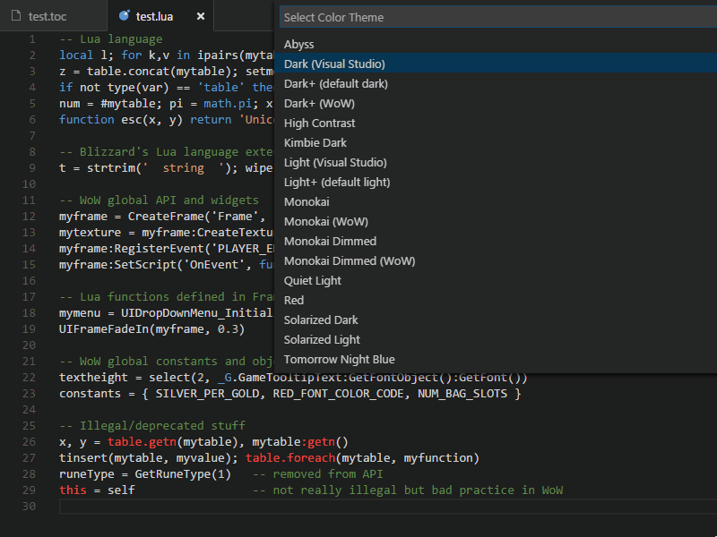

# wow-bundle for VS Code

This World of Warcraft addon developer toolset for VS Code includes an improved Lua language grammar with WoW API knowledge, a .toc file grammar, colorization for both .lua source and .toc files, and more.

## Features

* Improved Lua 5.1 grammar with World of Warcraft's built-in Lua interpreter specificities
* **Full Blizzard's 7.1.5 API**
* Extensive widgets and Lua library support
* `.toc` file colorization
* Four new, dedicated color themes based on VS Code's default themes: Light+, Dark+, Monokai and Monokai Dimmed

### Grammars

#### Lua 5.1 language

wow-bundle replaces VS Code's built-in Lua language grammar. Changes worth noticing are:

* **OO-style string functions** support, ie. both `string.upper(mystring)` and `mystring:upper()` are supported
* **Full metamethods** support
* **Quoted string constants** as used or returned by the `collectgarbage()`, `date()` and `type()` functions and the `__mode()` metamethod
* Better **character escapes** inside strings: Unicode entities, decimal and hexadecimal values and control chars
* **Deprecated features** warning: `table.foreach`/`foreachi`, `table.getn`/`setn`, `string.gfind()`...

#### World of Warcraft API

wow-bundle's Lua grammar also tags a bunch of WoW-related stuff with these comprehensive scopes:

* ~~**support.function.wow-language.lua** - Blizzard's extensions to the Lua language like `wipe()`, `strjoin()`, etc.~~ No more since 1.1.0, see change log.
* **support.function.wow-api.lua** - World of Warcraft API functions, with 2 sub-scopes:
	* **support.function.wow-api.nocombat.lua** - API functions that can't be called while in combat
	* **support.function.wow-api.protected.lua** - API functions that can be called only from secure code
* **support.function.wow-library.lua** - Library functions written in Lua (mostly used by UI code)
* **support.variable.object.wow-libray.lua** - Global objects like `UIParent`, `GameFontNormal` and such
* **support.variable.value.wow-library.lua** - Global variables like `HIGHLIGHT_FONT_COLOR_CODE`, `UIDROPDOWNMENU_INIT_MENU` and such
* **support.class.method.wow-api.lua** - Widgets methods like `:AddLine()`, `:SetTexture()` and such
* **support.constant.string-parameter.wow-api.lua** - Common function parameters like `'CheckButton'`, `'BOTTOMLEFT'`, `'OVERLAY'`, `'player'` and such
* **support.constant.script-handler.wow-api.lua** - Widgets event handler names like `'OnEnter'`, `'OnShow'` and such
* **support.constant.event-name.wow-api.lua** - Game events like `'PLAYER_ENTERING_WORLD'`, `'VARIABLES_LOADED'` and such
* **invalid.removed.lua** and **invalid.deprecated.lua** - Removed and/or deprecated stuff in the API

These scopes make it super-easy to colorize everyting WoW-related. See **Colorization** below for details.

#### Toc files

Also included is a simple grammar for `.toc` files with the following scopes:

* **keyword.control.toc** - keywords like `## Interface`, `## Author` and such
* **keyword.control.x.toc** - X-keywords like `## X-Date`, `## X-Website` and such

### Colorization

All VS Code themes should word fine with these scopes as long as they follow [the standard scope naming convention](https://manual.macromates.com/en/language_grammars).

However, for further colorization granularity, wow-bundle also includes four specific theme based on VS Code's default themes and called **Light+ (WoW)**, **Dark+ (WoW)**, **Monokai (WoW)** and **Monokai Dimmed (Wow)**. To choose one of these themes, open the Color Theme picker with **File** > **Preferences** > **Color Theme** (or **Code** > **Preferences** > **Color Theme** on Mac).

wow-bundle's themes only colorizes the scopes described above and does not interfere with VS Code default colors for Lua or any other language you may use.

>New since 1.0.1: I do however add italics to ALL comments ~~and underline to invalid/deprecated keywords~~.

>New since 1.0.7: No more underline for invalids, not everybody likes it.

## Known Issues

These are the currently known issues with wow-bundle. Should you whish to collaborate to the projet and help resolve these issues, you're welcome to submit a PR on Github.

* ~~The WoW API isn't fully complete yet, some 7.0.3 functions, methods and probably other things are still missing - I'll add them when time permits.~~ - Full 7.1 support since v1.1.0
* Because Blizzard's FrameXML code exposes hundreds of global functions, objects and variables, it is impossible to support them all. Therefore, only a selection of the most frequently used identifiers is supported. Please open an issue on Github if you need to add more.
* ~~Game events and widgets script handlers are still shown as regular strings. I'm looking for a way to make them stand appart.~~ - Fixed in 1.0.4

Found an issue not listed here? Head up to Github and [open an issue](https://github.com/Septh/vscode-wow-bundle/issues)!

## TODOs (and mayhaps)

1. ~~Fix above issues~~
2. Add code snippets
3. Support XML declarations too (low on my priority list, though)
4. ~~Support VS Code light themes?~~ ~~Support all standard VS Code themes~~ I'm done with themes - If you need more, just ask, I'll consider it
5. Linting anyone?
6. Or maybe code formating?
7. IntelliSense support would be great too (I have no idea where to start, though)
8. Add support for popular libraries like LibStub, Ace3, LibDataBroker...?

## Release notes

See [Changelog.md](CHANGELOG.md)

[wow-bundle]: https://github.com/Septh/vscode-wow-bundle
[VS Code]: https://code.visualstudio.com/
