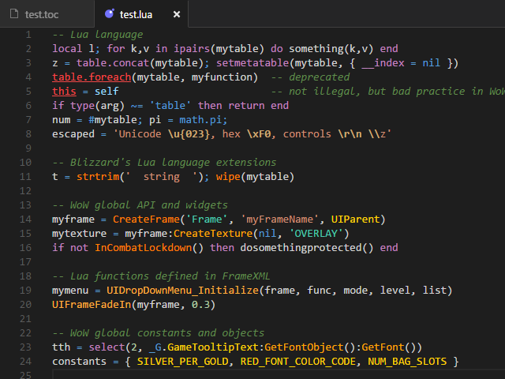
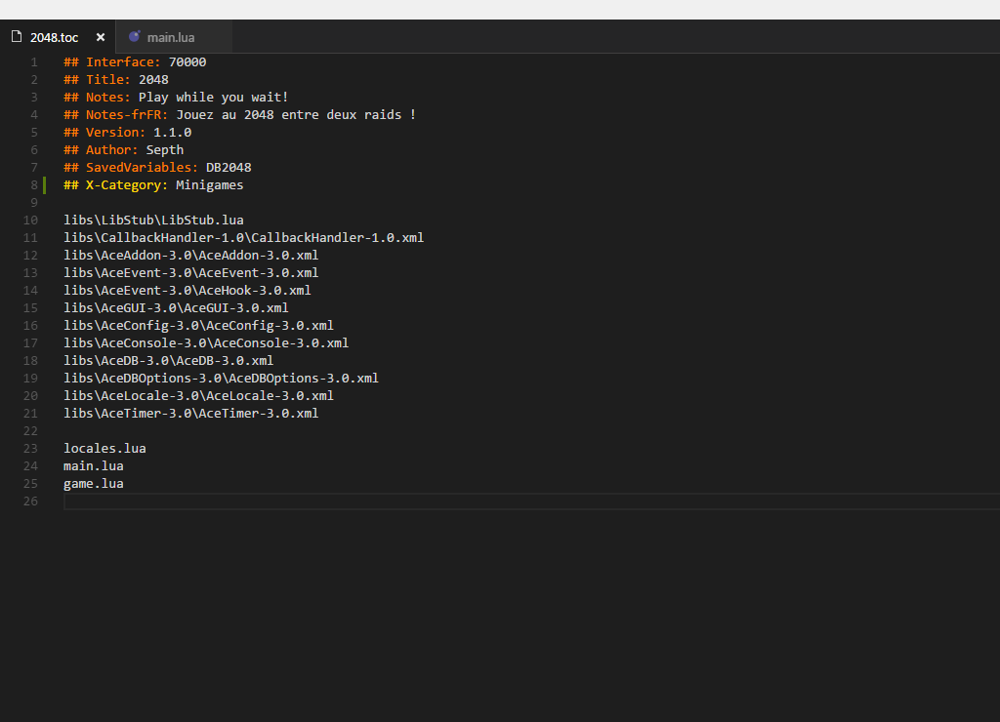
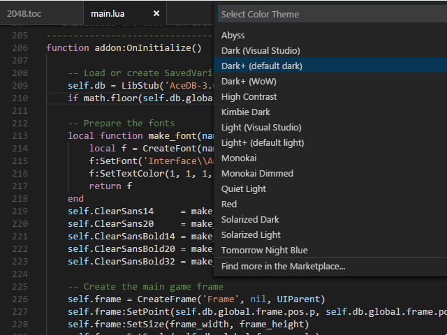

# wow-bundle for VS Code
This World of Warcraft addon developper toolset for VS Code includes an improved Lua language grammar with WoW API knowledge, a .toc file grammar, colorization for both Lua and TOC sources, and more.

## Features
* Improved Lua grammar
* Blizzard's Lua language extensions, WoW API and libraries support
* `.toc` file colorization
* A new, dedicated color theme based on VS Code's Dark+

### Grammars

#### Lua source
wow-bundle improves VS Code's built-in Lua language grammar. Worth noticing are references to metamethods, deprecated stuff like `foreach`/`foreachi` and  a bunch of WoW-related stuff with comprehensive scopes:

* **support.function.wow.language.lua** - Blizzard's extensions to the Lua language like `wipe()`, `strjoin()`, etc.
* **support.function.wow.api.lua** - World of Warcraft API functions, with 2 sub-scopes:
	* **support.function.wow.api.nocombat.lua** - API functions that can't be called while in combat
	* **support.function.wow.api.protected.lua** - API functions that can be called only from secure code
* **support.function.wow.library.lua** - Library functions written in Lua (mostly used by UI code)
* **support.class.wow.global.lua** - Global objects like `UIParent`, `GameFontNormal` and such
* **support.class.wow.method.lua** - Widgets methods like `:AddLine()`, `:SetTexture()` and such
* **support.constant.wow.global.lua** - Global constants like `HIGHLIGHT_FONT_COLOR_CODE`, `UIDROPDOWNMENU_INIT_MENU` and such
* **support.constant.wow.quoted.function-parameter.lua** - Common function parameters like `'CheckButton'`, `'BOTTOMLEFT'`, `'OVERLAY'`, `'player'` and such
* **support.constant.wow.quoted.script-handler.lua** - Widgets event handlers like `'OnEnter'`, `'OnShow'` and such
* **support.constant.wow.quoted.event-name.lua** - Game events like `'PLAYER_ENTERING_WORLD'`, `'VARIABLES_LOADED'` and such
* **support.XXX.wow.removed.lua** - Removed and/or deprecated stuff in the API, were, `XXX` can be one of `function`, `class`, `variable` or `constant`

#### Toc files
Also included is a simple grammar for `.toc` files with the following scopes:

* **keyword.other.toc** - keywords like `## Interface`, `## Author` and such
* **support.other.toc** - X-keywords like `## X-Date`, `## X-Website` and such

### Colorization
Standard VS Code themes should work well with these scopes. However, for further colorization granularity, wow-bundle also includes a specific theme based on VS Code's Dark+ default theme and called **Dark+ (WoW)**. To enable this theme, open the Color Theme picker with **File** > **Preferences** > **Color Theme** (or **Code** > **Preferences** > **Color Theme** on Mac).

**Dark+ (WoW)** only colorizes the scopes described above and does not interfere with Dark+ default colors for Lua or any other language you may use.
>New to 1.0.1: **Dark+ (WoW)** adds italics to comments and underline to invalid/deprecated keywords in Lua source files. I like it this way. :)

## Known Issues
These are the currently known issues with wow-bundle. Should you whish to collaborate to the projet and help resolve these issues, you're welcome to submit a PR on Github.

* The WoW API isn't fully complete yet, some 7.0.3 functions, methods and probably other things are still missing - I'll add them when time permits.
* Because Blizzard's FrameXML code exposes hundreds of global functions, objects and variables, it is impossible to support them all. Therefore, only a selection of the most frequently used identifiers is supported. Please open an issue on Github if you need to add more.
* ~~Game events and widgets script handlers are still shown as regular strings. I'm looking for a way to make them stand appart.~~ - Fixed in 1.0.4

## TODO (and wishes)
1. Fix above issues
2. Add code snippets
3. Support XML declarations too (low on my priority list, though)
4. ~~Support VS Code light themes?~~ Support all standard VS Code themes
5. Linting anyone?
6. Or maybe code formating?
7. IntelliSense support would be great too (I have no idea where to start, though)
8. Add support for popular libraries like LibStub, Ace3, LibDataBroker...?

## Release notes

### 1.0.5
* [misc] Removed old `./sources` directory which was completely out of sync

### 1.0.4
* [language.lua] Finally found a way to differenciate quoted constants like functions parameters, event names, script handlers... from strings
* [language.lua] `message()`, `print()`, `getprinthandler()`, `setprinthandler()`, `tostringall()` are actually Lua code in FrameXML, not language extensions
* [language.lua] Added some 7.0.3 identifiers, many are still missing though
* [theme] Changed colors of .toc file keywords for consistency with the default Dark+ colors
* [misc] When the source code reads _'For testing only, comment out before publishing'_, well... just do it

### 1.0.3
* [language.toc] Renamed `keyword.language.toc` and `support.language.toc` scopes to `keyword.other.toc` and `support.other.toc`
* [language.lua] Added a bunch of API definitions
* [language.lua] `tinsert()` and `tremove()` were actually Blizzard language extensions that got removed in WoW 6.0.2

### 1.0.2
* [language.lua] Stupid typo fix
* Updated `Readme.md`

### 1.0.1
* [theme] Stop recolorizing the default Lua language constructs, you'll really get Dark+ colors for these
* Reorganized the internal directory structure in preparation for TODO #4

### 1.0.0
Initial release.
